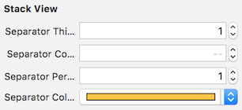

# StackViewSeparator

[](https://travis-ci.org/barisatamer/StackViewSeparator)
[](http://cocoapods.org/pods/StackViewSeparator)
[](http://cocoapods.org/pods/StackViewSeparator)
[](http://cocoapods.org/pods/StackViewSeparator)


## Example

To run the example project, clone the repo, and run `pod install` from the Example directory first.

## Requirements

## Installation

StackViewSeparator is available through [CocoaPods](http://cocoapods.org). To install
it, simply add the following line to your Podfile:

```ruby
pod 'StackViewSeparator'
```

### Storyboard
Thickness, Corner Radius, Percent, Color can be set 



### Code
```swift
import StackViewSeparator

let stackView = UIStackView(frame: CGRect(x: 0, y: 0, width: 100, height: 100))
...
...
stackView.separatorColor = .blue
stackView.separatorThickness = 3
stackView.separatorCornerRadius = 1
stackView.separatorPercent = 0.7 // 0...1 
```

## Author

Baris Atamer, brsatamer@gmail.com

## License

StackViewSeparator is available under the MIT license. See the LICENSE file for more info.
